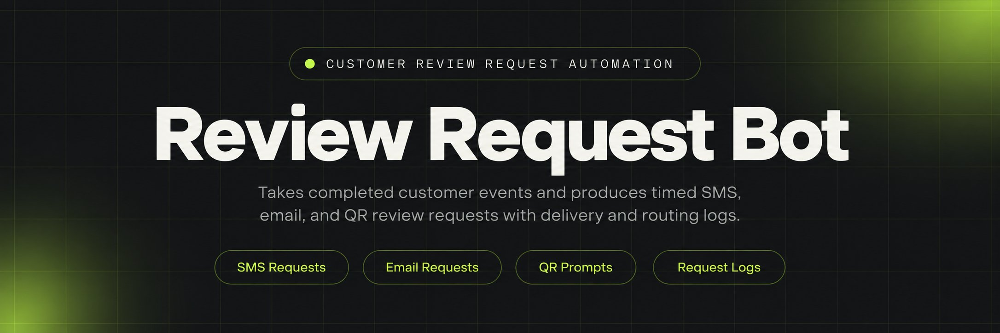
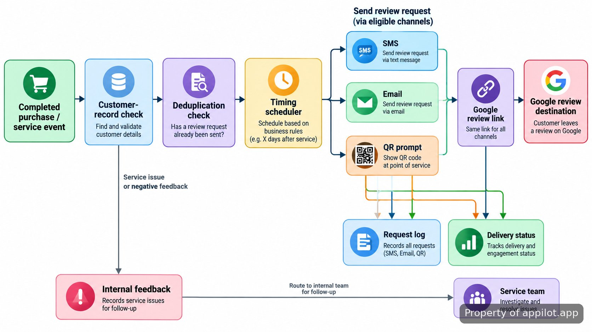

<p align="center">
  <a href="https://www.appilot.app" target="_blank" rel="nofollow">
    
  </a>
</p>

## Google Review Bot

> Real customers, right timing, more reviews.

The Google Review Bot is the review-request system I run after a real purchase or completed service. It does not write reviews, post reviews, create reviewer accounts, or simulate customer activity. The job is narrower: take a known past customer, wait until the configured post-purchase or post-service moment, send a request through SMS or email, and provide a QR route for in-person use. The final destination is the business's <a href="https://support.google.com/business/answer/3474122?hl=en" target="_blank" rel="nofollow">Google Business Profile review flow</a>.

That distinction matters because Google requires Maps contributions to reflect genuine experiences and prohibits fake engagement, incentives, and selective practices that manipulate ratings. The <a href="https://support.google.com/contributionpolicy/answer/7400114?hl=en-GB" target="_blank" rel="nofollow">Maps user-contributed content policy</a> is the operating boundary for this repository. The automation handles the request and routing; the customer decides whether to review and what to say.

The use case is practical for a single local business and for an agency that keeps separate profile settings for multiple locations. A 2026 <a href="https://www.brightlocal.com/research/local-consumer-review-survey/" target="_blank" rel="nofollow">local consumer review survey</a> of 1,002 US adults reported that 97% read reviews for local businesses, while 78% had been asked for feedback in the previous year. The useful automation problem is therefore not manufacturing sentiment; it is making a legitimate request reliably after the real customer event.

<a href="https://www.appilot.app" target="_blank" rel="nofollow">
  
</a>

<p align="center">
  <a href="https://t.me/Bitbash333" target="_blank" rel="nofollow">
    
  </a>&nbsp;
  <a href="https://wa.me/923249868488?text=Hi%2C%20I%27m%20interested." target="_blank" rel="nofollow">
    
  </a>&nbsp;
  <a href="mailto:hello@appilot.app" target="_blank" rel="nofollow">
    
  </a>&nbsp;
  <a href="https://www.appilot.app" target="_blank" rel="nofollow">
    
  </a>
</p>

## How the request flow works

A run begins with a completed customer event: an order marked fulfilled, a service marked complete, or a manual CSV/import row using the same fields. The intake normalizes the customer name, contact channel, business profile key, completion timestamp, and source reference. A deduplication check stops the same transaction from producing another request when the event is replayed or imported twice.

Eligible records move into the scheduler. The configured delay is applied to the completion timestamp, then the dispatcher selects SMS, email, or the QR path. SMS is sent through <a href="https://www.twilio.com/docs/messaging/tutorials/how-to-send-sms-messages" target="_blank" rel="nofollow">Twilio Programmable Messaging</a>; email uses the <a href="https://www.twilio.com/docs/sendgrid/api-reference/mail-send" target="_blank" rel="nofollow">SendGrid Mail Send API</a>. The message template contains the business-specific review destination rather than generated review text.

If a feedback step is enabled before the external review destination, it should be used for service recovery without hiding the review option from dissatisfied customers. Google explicitly allows businesses to ask for reviews from genuine customers but does not allow discouraging negative reviews or selectively soliciting positive ones. That policy constraint is part of the workflow, not an afterthought.



## Core Features

| Feature | Description |
| --- | --- |
| Completed-event intake | Manual follow-up is easy to forget or send too early. The intake accepts finished purchase or service records, normalizes the fields, and turns each eligible record into a request job. |
| Timed request scheduler | Immediate requests can arrive before the customer has finished the experience. The scheduler holds each job until its configured post-purchase or post-service send time. |
| SMS delivery | Copying numbers into a phone or messaging console creates missed sends and inconsistent templates. The dispatcher sends the approved request template through the configured SMS provider and records delivery state. |
| Email delivery | Separate email follow-up creates another queue to maintain. The same request job can use the configured email template and provider while keeping the customer, transaction, and profile reference together. |
| QR request path | Counter staff and field teams need a request route that does not require typing a link. The tool produces a scannable QR target using the same review destination used by digital requests. |
| Profile-aware routing | Agencies can mix up destinations when they manage several businesses. Each job carries a profile key so the request resolves to the correct business review link. |
| Deduplication and request log | Retries and repeated imports can send the same customer twice. A source reference and request state prevent duplicate dispatch and leave a record of queued, sent, failed, or skipped work. |

## What it runs on

The repository is a small Python service rather than a browser macro. <a href="https://docs.python.org/3/" target="_blank" rel="nofollow">Python 3</a> runs the worker and message adapters; <a href="https://fastapi.tiangolo.com/" target="_blank" rel="nofollow">FastAPI</a> exposes the intake and admin endpoints; SQLite stores customers, profile settings, jobs, and delivery results; and APScheduler handles delayed dispatch. That split keeps the request logic testable without coupling it to the dashboard.

| Layer | Role in this repository |
| --- | --- |
| FastAPI | Receives completed-customer events, exposes health/status routes, and serves the small admin surface. |
| SQLite | Keeps profile configuration, source references, request jobs, timestamps, and delivery outcomes in one local database. |
| APScheduler | Loads due jobs and hands them to the dispatcher without requiring a separate queue service for this installation. |
| Twilio adapter | Sends SMS requests and returns provider identifiers or failures to the request log. |
| SendGrid adapter | Sends email requests from the same normalized job model used by SMS. |
| QR generator | Creates an SVG/PNG code from the stored review destination for print or on-screen prompts. |

The channel adapters are deliberately thin. A request job is created once; the dispatcher decides which adapter to call, and each adapter returns a normalized result to the same log. That keeps provider-specific response formats out of the scheduling code and makes failures visible in one place.

<a href="https://tally.so/r/yP5oDx?platform=GitHub&amp;format=Product+repo&amp;brand=Appilot&amp;niche=appilot&amp;page=Google+Review+Bot+with+Google+Business+Profile&amp;date=2026-09-15" target="_blank" rel="nofollow">
  
</a>

## Repository layout

The code is separated by responsibility so the parts that decide *who should be asked and when* are not mixed with the parts that actually send a message. Profile configuration lives outside templates, and provider credentials stay in environment variables. Tests mirror the request lifecycle rather than only exercising individual helper functions.

```text
review-request-automation/
├── src/
│   ├── api.py
│   ├── config.py
│   ├── db.py
│   ├── models.py
│   ├── scheduler.py
│   ├── dispatcher.py
│   ├── policies.py
│   ├── providers/
│   │   ├── twilio_sms.py
│   │   ├── sendgrid_email.py
│   │   └── qr.py
│   └── templates/
│       ├── sms.txt
│       ├── email_subject.txt
│       └── email_body.txt
├── data/
│   ├── profiles.example.json
│   └── imports/
├── tests/
│   ├── test_deduplication.py
│   ├── test_scheduler.py
│   ├── test_routing.py
│   └── test_providers.py
├── scripts/
│   ├── import_customers.py
│   └── make_qr.py
├── .env.example
├── requirements.txt
└── README.md
```

The important boundary is `policies.py`: eligibility, deduplication, and review-routing rules are decided there before any provider call. The provider modules never decide whether a customer is eligible; they only deliver an already-approved request. That makes policy changes reviewable in one file and reduces the chance that SMS and email behave differently.

## How to Request Reviews Using Google Review Bot

- **STEP 1 — Download & Set Up the Project** — Download, set up, and install **Google Review Bot** from this repository, install the pinned Python requirements, copy `.env.example`, and add provider credentials plus profile settings.
- **STEP 2 — Open the Admin Surface** — Start the FastAPI app, open the local admin page, and confirm the target business profile, SMS sender, email sender, and review destination.
- **STEP 3 — Load Real Customer Events** — Submit completed purchase or service records with customer name, phone or email, completion time, source reference, channel, and business profile key.
- **STEP 4 — Dispatch and Check Output** — Run the scheduler worker, then read the request log for queued, sent, failed, or skipped states and the provider message identifier where available.

```bash
python -m venv .venv
source .venv/bin/activate
pip install -r requirements.txt
cp .env.example .env
uvicorn src.api:app --host 127.0.0.1 --port 8000
```

For an import-driven run, I use the source transaction or job ID as the deduplication key rather than the customer address alone. The same customer may legitimately return for another purchase, but the same completed transaction should not create two requests.

## Use Cases

- **Local service follow-up:** a completed appointment enters the queue after the technician or operator marks the job finished, so the customer receives one request tied to that real service event.
- **Post-purchase request:** a fulfilled order can use email or SMS after completion rather than relying on staff to remember which customers have already been contacted.
- **Agency profile separation:** profile keys keep each managed business's templates and review destination distinct, reducing the risk of sending a customer to the wrong listing.
- **In-person QR prompt:** a printed or on-screen QR code gives a verified customer a direct route at a counter, reception desk, or service handoff without staff dictating a URL.

The same mechanism fits all four cases because the unit of work is a completed customer event, not a scraped lead or anonymous audience. That is also why the repository does not include account creation, review text generation, star-rating automation, or bulk posting. Those actions are outside the tool's purpose and conflict with the requirement that reviews represent genuine experiences.

## Policy, reliability, and outputs

The most important failure mode is not a crashed worker; it is sending the wrong request to the wrong person or using automation in a way that becomes review gating. Eligibility is therefore checked before dispatch, every job carries a profile key, and duplicate source references are skipped. Provider failures remain failed jobs rather than silently becoming sent jobs.

Google's own guidance says businesses may remind customers to leave reviews through a link or QR code, while incentives and misleading engagement are prohibited. A separate 2026 <a href="https://www.brightlocal.com/research/consumer-search-behavior-decisions/" target="_blank" rel="nofollow">consumer search behavior study</a> found that star rating and review count were among the most-cited factors when people evaluated local businesses. That supports asking real customers consistently; it does not justify filtering out unhappy customers or fabricating praise.

The normal outputs are operational: a request record, scheduled/send timestamps, channel, profile key, provider status, optional provider message identifier, and the review destination used for that job. QR generation also writes the code asset for printing or display. No output field contains generated review copy.

I do not publish a throughput or delivery-latency benchmark here because the brief does not provide a measured one, and SMS/email delivery time depends partly on external providers. The repository instead exposes the timestamps needed to measure queue delay, dispatch duration, delivery result, duplicate skips, and failed sends on the installation where it actually runs. That is more useful than a synthetic number presented as universal performance.

## FAQ

### Does it create or post reviews automatically?

No. It sends review requests to real past customers and routes them to the configured Google review destination; it does not generate review text, choose star ratings, create accounts, or submit reviews. The reviewer controls whether to post and what to write.

### Can one installation handle more than one business profile?

Yes. The request model carries a business profile key, and each profile can have its own review destination and message settings. That lets an agency keep managed locations separated while using the same scheduler and request log.

### How should review routing be configured to follow Google policy?

Use real customer events, avoid incentives, and do not suppress the review option because a customer reports a poor experience. Internal feedback can trigger service recovery, but the configuration should not selectively ask only satisfied customers for public reviews. Google's fake-engagement policy is the reference point for that rule.

<table>
  <tr>
    <td align="center" width="33%">
      
      <p>This scraper helped me gather thousands of posts effortlessly. The setup was fast, and exports are super clean and well-structured.</p>
      <p><b>Nathan Pennington</b><br>Marketer<br>★★★★★</p>
    </td>
    <td align="center" width="33%">
      
      <p>What impressed me most was how accurate the extracted data is. Likes, comments, timestamps — everything aligns perfectly.</p>
      <p><b>Greg Jeffries</b><br>SEO Affiliate Expert<br>★★★★★</p>
    </td>
    <td align="center" width="33%">
      
      <p>It's by far the best tool I've used. Ideal for trend tracking, competitor monitoring, and influencer insights.</p>
      <p><b>Karan</b><br>Digital Strategist<br>★★★★★</p>
    </td>
  </tr>
</table>